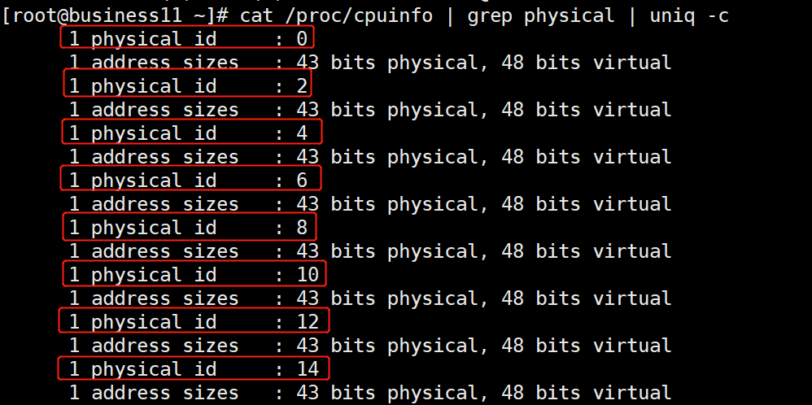
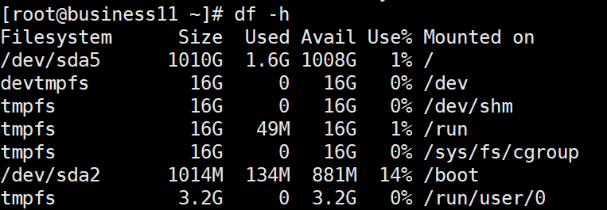

# 个人常用Linux命令

<!-- more -->

## 系统相关

### 查询系统详情

```shell
# 详细输出所有信息，依次为内核名称，主机名，内核版本号，内核版本，硬件名，处理器类型，硬件平台类型，操作系统名称
uname -a
```


### 查询系统发行版本

```shell
# 只适合Redhat系的Linux
cat /etc/redhat-release
```


### 查看CPU信息

```shell
# 逻辑CPU数量和CPU型号
cat /proc/cpuinfo | grep name | cut -f2 -d: | uniq -c
```


```shell
# CPU真实数量（有时候虽然逻辑CPU是8核，但可能是由两颗4核CPU构成的）
cat /proc/cpuinfo | grep physical | uniq -c
```



### 查询RAM信息(内存)

```shell
# 用于查看有关系统 RAM 使用情况的信息（带大小单位）
free -h
```


### 查询ROM信息(磁盘)

```shell
# 以磁盘分区为单位查看文件系统，可以获取硬盘被占用了多少空间，目前还剩下多少空间等信息
df -h
```



