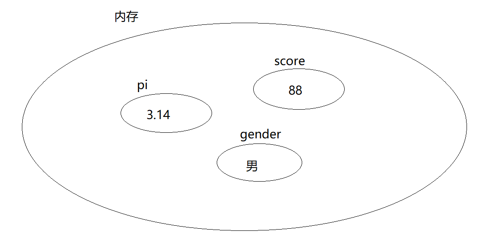
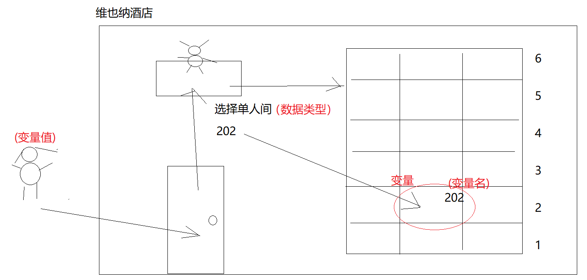
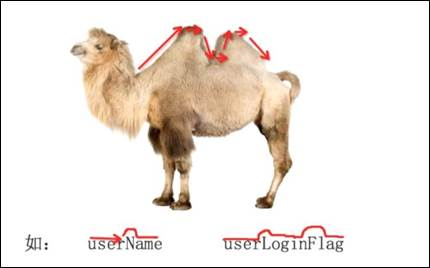

# 变量和常量

## 前言

**C：** 上一篇，笔者给你加了点“料”，捋了捋一个 QQ 程序从安装到运行起来究竟做了哪些事儿。在上一篇的最后，我们还分析到了一个结果就是当程序运行在内存中后，程序产生的数据也要在内存中妥善的管理起来，以方便使用和复用，这种基础的数据管理概念就是 **变量** 。


不知道，大家是否还记得在[《开发环境搭建》](./01-开发环境搭建)中我们介绍过一个环境变量的概念，**环境变量就是操作系统里存储的一些环境参数或关键值，每个在操作系统里运行的程序都可以获取到这些存储的内容** 。因为它存储的是环境信息，又因为这些信息是可变的值，所以它叫环境变量。

而本篇我们也要正式学习下 Java 程序中的变量，它是我们学习的第一个基础知识点，先来感受下它的用处吧，例如下方代码，在进行输出个人介绍时，如果想修改姓名的话，需要单个依次修改。

此时我们就可以将个人介绍中的姓名存储成变量，然后就可以很方便的修改或重复使用了。

```java
// 未使用变量
System.out.println("我是时间管理大师：小罗");
System.out.println("我是时间管理大师：小罗");
System.out.println("我是时间管理大师：小罗");
System.out.println("我是时间管理大师：小罗");
```

```java
// 使用变量
String name = "小罗";
System.out.println("我是时间管理大师：" + name);
System.out.println("我是时间管理大师：" + name);
System.out.println("我是时间管理大师：" + name);
System.out.println("我是时间管理大师：" + name);
```

<!-- more -->

## 变量概述

::: tip 笔者说
变量来源于数学，是计算机语言中能 **储存计算结果或能表示值** 的抽象概念。在一些语言中，变量可能被明确为是能表示可变状态、具有存储空间的抽象（如在 Java 和 Visual Basic 中）。[1~2]
:::

如下图，当 Java 程序运行过程中，我们需要存储一些数据，此时就可以在内存开辟一个个变量空间来存储这些可变的数据。



通俗的来讲：变量就是一个数据存储空间的表示，不同数据存入具有不同内存地址的空间，彼此相互独立。

## 变量的组成

将数据以 变量 形式存入内存之后，我们怎么找到和使用它呢？

- 第1种方式：可以通过内存地址值去寻找。但是这地址值是类似于：0x12345….这种无关联的组成，每次记忆极其繁琐。
- 第2种方式：使用变量名来快速简便的找到存入的变量，找到变量自然也就找到数据了。

其实变量这个概念，可以去类比生活中去酒店入住的场景。

酒店就是 `JVM` 内存，房间就是一个个的 `变量`，房间的名字就是 **变量名**（毕竟你想想酒店前台告诉你房间位置时，应该都是告诉你房间号，而不是给你指路：上3楼直走5个房间，右转后第3个房间对面）；

酒店还会为不同客人提供不同类型的房间，满足特别的需求。`JVM` 内存中，也是这么来安排数据的，我们称之为**变量类型** ；房间里入住的客人就是 **变量里存储的值** 。

而且变量即可以变化的量，酒店房间的客人也是变动的，这么理解起来，简直太容易了。所以笔者建议你，以后想到变量就多想想开房。



::: tip 笔者说
所以，变量的组成是由：变量名、变量类型、变量值三个部分组成。  

变量值就没必要看了，它就是你要存储的数据，爱存啥就存啥，但是其他的两个部分我们需要详细研究研究。
:::

### 变量名

**变量名也就是标识符，其实就是为了方便区分不同的变量。但这个名也不是随便起的，在长久的演化中，我们有了约定俗成的规范。**      

::: warning 变量名命名规范
1. 可以使用数字、字母，下划线和 `$` 符号组成，但数字不能开头。

2. 不能使用关键字（`public`、`void`等）和保留字（`goto`、`def`等）！**关键字：被系统定义了特殊含义的单词。保留字：现在还不是关键字，未来可能有特殊含义。** 

3. 起名要见名知意。 例如：`name` 一看就知道是名字，`password`是密码等。

4. 采用小驼峰式命名法（Lower Camel Case）。(所谓小驼峰命名法，即首字母小写，如果有多个单词那么后面的每个单词首字母大写。`e.g. userPassword`) ；另外因为支持下划线，所以有些时候会有下划线连接法命名的变量。`e.g. user_password`。

   

5. 要么名称全为拼音，要么全为英文单词。`e.g.（X）myMingZi`。

   
:::

### 数据类型

不同类型的值要以不同的形式存储，那么在 Java 中，它将不同的值划分了多少类型呢？

**数值型有：** 

- 整型：byte、short、int、long   
- 浮点型：float、double

**非数值型：** char（字符型） 、boolean（布尔型） 、String（字符串型，一个比较特别的类型，先记住它不是基本数据类型，是引用数据类型即可）

下方是数值型数据类型的取值范围表：

| 数据类型 |      大小       |                    取值范围                    |
| :------: | :-------------: | :--------------------------------------------: |
|   byte   |    1字节8位     |                  -128 ~ +127                   |
|  short   |    2字节16位    |     -32768 (-2^15^) ~ +32767 (+2^15^ - 1)      |
|   int    |    4字节32位    | -2147483648 (-2^31^) ~ +2147483647 (2^31^ - 1) |
|   long   |    8字节64位    |              -2^63^ ~ +2^63^ - 1               |
|  float   | 4字节32位浮点数 |     1.4E-45 ~ 3.4E+38, -1.4E-45 ~ -3.4E+38     |
|  double  | 8字节64位浮点数 |   4.9E-324 ~ 1.7E+308, -4.9E-324 ~ -1.7E+308   |

::: tip 笔者说
在 Java 中，如果定义一个变量，**整数数据默认为 int 类型，小数数据默认为 double 类型。**   

因为 int 和 double 的取值范围已经满足了我们大多数时的使用要求了。
:::

## 变量的使用步骤

聊完了概念后，我们接下来一起用一下吧！

第一步：声明变量，根据数据类型在内存申请空间。

```java
// 数据类型 变量名;
int money;
```

第二步：赋值，即“将数据存储至对应的内存空间”。

```java
// 变量名 = 数值;
money = 1000;
```

tips:第一步和第二步可以合并。

```java
// 数据类型 变量名 = 数值;
int money = 1000;
```

第三步：使用变量，即“取出数据使用”。（也就是拿着变量名去使用）

```java
public class Demo1{
    public static void main(String[] args){
        // 在方法中声明的变量 被称为局部变量  局部变量如果没赋值前是无法使用的
        // 第1种使用方式  先声明再赋值
        // 声明变量（联想记忆：在内存中开好201双人房间）
        // 此变量将用来存储银行卡存款
        int money; 
        // 赋值 =号不再是数学里的相等，而是表示将右边的内容赋值给左边的
        money = 1000;
        
        // 第2种使用方式  声明的同时并赋值
        int money1 = 1000;
        // 使用变量
        System.out.println("我的银行存款为：" + money1 + "元");
    }
}
```

再来个小练习，吸收一下吧，案例需求如下：

**要求使用变量来完成如下操作：** 
- 输出Java课考试最高分：98.5
- 输出最高分学员姓名：张三
- 输出最高分学员性别：男

```java
// 声明一个变量用来存储最高分
double score = 98.5;
// 如果是float类型来存储数据，那么必须在值后添加 f/F
// 其实double类型的后面也应该加d/D，但Java中出现的浮点类型默认为double，所以不需要加
// float score1 = 98.5F;

// 声明一个变量用来存储学员姓名
// 双引号包裹的内容是一个字符串
String name = "张三"; 
// 声明一个变量用来存储学员性别
// 单引号包裹的事一个字符
char gender = '男';

// 使用变量：使用+号来拼接使用变量
// 只要是与字符串用+号拼接的都成为了字符串
System.out.println("最高分为：" + score);
System.out.println("姓名为：" + name);
System.out.println("性别为：" + gender);
// 等价于下方
System.out.println("最高分为：" + score + "\n姓名为：" + name + "\n性别为：" + gender);
```

## 常量概述

在程序运行中，我们需要使用一些数据，但是这些数据在存储好后不应该再次发生变化（例如：`π`）。这时候，单纯使用变量存储，毕竟叫变量，难保未来可能被不小心重新赋值。

此时我们可以使用常量来解决此问题。

::: tip 笔者说
在Java中，其值不能改变的变量被称为常量。常量被final修饰，被final修饰则无法二次修改值。
:::

为了和变量做出区别，常量在命名上也有一些小要求。  

::: warning 常量名命名规范
1. 常量名所有字母都要大写。

2. 如果有多个单词，多个单词之间使用下划线分隔。例如：`MY_NAME`

3. 只能被赋值一次（被final修饰），通常定义时即对其初始化。
:::

```java
public class Demo2{
    public static void main(String[] args){
        // 声明一个变量 用来表示π
        // 被final修饰的变量，无法再进行第二次改值 必须进行初始赋值，不能分开声明和赋值
        final double PI = 3.14;
        // 声明一个变量用来表示半径
        int radius = 7;
        
        // 计算圆的面积 π * r * r
        double area = PI * radius * radius;
        System.out.println("圆的面积为：" + area);
    }
}
```

## 程序交互

在上述的练习使用中，笔者定义的变量全是自己直接定义好值的。如果现在想要让变量值变成一个灵活动态的内容，通过键盘来灵活输入，这时候我们就需要使用 Java 给我们准备好的 `Scanner` 工具来解决。

**Scanner的使用需要一个固定的步骤！前期牢记即可！后期学习`类`之后就懂了。**

第一步：导入`Scanner`类。

```java
import java.util.Scanner;
```

第二步：创建`Scanner`对象。

```java
Scanner input = new Scanner(System.in);
```

第三步：获得键盘输入的数据，并自动将其转换存储为`int`类型的变量`now`。

```java
int now = input.nextInt();
```

```java
// 1.在类声明上方 添加导入语句
import java.util.Scanner;

public class Demo3{
    public static void main(String[] args){
        // Scanner 可以用来进行键盘录入的API
        // 2.创建Scanner对象  input就是个变量名
        Scanner input = new Scanner(System.in);
        
        // 3.使用Scanner的方法   对象名.xxx()来调用方法
        System.out.print("请输入您的年龄：");
        int age = input.nextInt();
        
        System.out.println("输入的年龄为：" + age);
    }
}
```

## 类型转换

上述就是变量的基本玩法，简单吗？接下来我们再了解一些特别的小知识，加深你对数据类型的理解。

### 自动类型转换

看一下下方的代码，`double `类型的变量竟然在存储整数类型？而且它不会出现任何语法错误？

```java
// 自动类型转换
double num1 = 10;
System.out.println(num1); // 10.0
// 两个操作数只要其中一个是double类型的，那么计算结果就会提升为double类型
// 取值范围小的 自动类型转换为  取值范围大的
double num2 = 10 + 10.1;
System.out.println(num2); // 20.1
```

这是因为在 Java 中，如果两种类型相互兼容（例如整型和浮点型同属数值类型），那么取值范围小的类型(精度低)，可以自动类型转换为取值范围大的类型(精度高)。

### 强制类型转换

有自动类型转换，那应该也有非自动的，我们称之为强制类型转换。

看个小例子：去年Apple笔记本所占市场份额是20，今年增长市场份额是9.8，求今年所占份额？

```java
// apple 笔记本市场份额
int before = 20;
// 增长的份额
double rise = 9.8;
// 现在的份额
int now = (int)before + rise; // 29  不是四舍五入，是直接取整了
```

我们发现，上面的代码最后结果使用了`int`来存储，但是却需要用`(int)`来标注一下，否则会提示语法错误。这是因为当`int`和`double`型数据计算后，它们的结果值已经自动类型转换为了`double`型，而最后又要将其转换为`int`型，也就是将一个取值范围大(精度高)的数据，存储到取值范围小的(精度低)类型里，那自然会损失精度(小数点位的值全丢了)，所以需要自己手动标注一下，表明我们自己认可这件事。

::: tip 帮助理解类型转换的故事
假设现在有一个100斤的小麦口袋，还有一个40斤的大米口袋，如果我想把两个口袋换着装东西，40斤大米口袋内的大米自然可以放到100斤小麦口袋里(自动类型转换)，但是反之则不行，如果非要这么做，多余的小麦肯定会洒出来（强制类型转换）。
:::

```java
// 口袋：100斤小麦
double mian = 100;
// 口袋：40斤大米
int mi = 40;

mi = (int)mian;
```

## 出题环节

### 变量练习

::: details 需求：使用变量分别存储个人基本信息，然后逐行输出个人基本信息。
提示：个人基本信息可包括：姓名、年龄、性别、身高、体重、婚否等
:::

::: details 需求：使用 Scanner 分别录入个人基本信息、并逐行输出。
提示：个人基本信息可包括：姓名、年龄、性别、身高、体重、婚否等
:::

## 参考文献

[1]谭浩强. C程序设计（第4版）：清华大学出版社，2010.6

[2]明日科技. Visual Basic从入门到精通：清华大学出版社 ，2017.6

## 后记

无论是学习任何编程语言，变量都是必不可少的一个基础内容，所以，结合上一篇《Java语法 | 程序的那点事儿》好好在脑海中构想一下变量在内存中的使用吧。


::: info 笔者说
对于技术的学习，笔者一贯遵循的步骤是：先用最最简单的 demo 让它跑起来，然后学学它的最最常用 API 和 配置让自己能用起来，最后熟练使用的基础上，在空闲时尝试阅读它的源码让自己能够洞彻它的运行机制，部分问题出现的原因，同时借鉴这些技术实现来提升自己的代码高度。

所以在笔者的文章中，前期基本都是小白文，仅仅穿插很少量的源码研究。当然等小白文更新多了，你们还依然喜欢，后期会不定时专门对部分技术的源码进行解析。
:::

